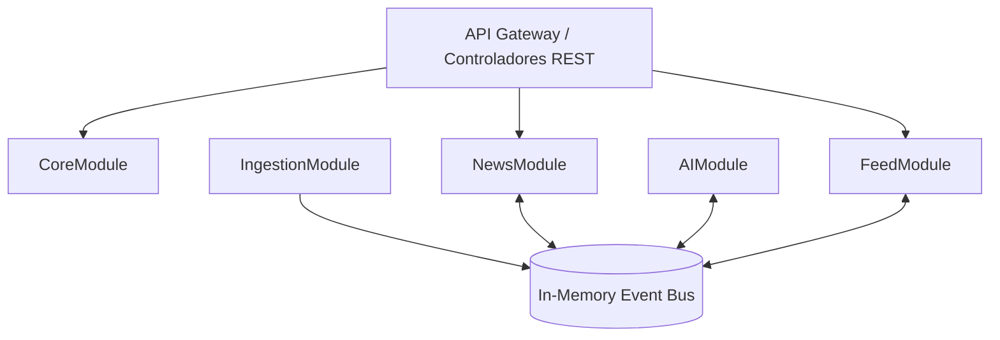

# Arquitectura de NovaNews OS (Fase Monolito Modular)

_Toda decisión técnica subyacente requiere un ADR aprobado en `docs/adr/`._

## 1. Arquitectura Lógica (Monolito Modular)

El sistema operará bajo un único proceso (Monolito), pero dividido en módulos lógicos con límites estrictos.

- **CoreModule**: Gestión de usuarios, autenticación (JWT/OAuth), RBAC, suscripciones.
- **NewsModule**: Gestión del ciclo de vida de la noticia (Borrador, Publicado, Archivado), categorías, metadatos.
- **IngestionModule**: Recepción de datos crudos (Webhooks de crawlers), limpieza inicial.
- **AIModule**: Coordinación de inferencia (llamadas a LLMs, generación de resúmenes, extracción de tags, análisis de sesgo).
- **FeedModule**: Lógica de recomendación y personalización de feeds por usuario.

## 2. Arquitectura Física y Cloud

- **Cómputo**: AWS Elastic Beanstalk o GCP Cloud Run (Contenedores sin servidor para MVP).
- **Caché**: Redis (Almacenamiento de sesiones, feeds calculados y rate limiting).
- **Storage**: AWS S3 / GCS (Para imágenes y multimedia).
- **CDN**: Cloudflare (Caché de frontend y protección DDoS).

## 3. Arquitectura de IA y Multiagente

- **Capa de Orquestación**: Un pipeline (LangChain o nativo) gestiona los prompts.
- **Flujo**:
  1. Ingestion detecta nueva noticia.
  2. Lanza evento `NewsIngested`.
  3. AIModule escucha y ejecuta `AnalyzerAgent` (extrae contexto).
  4. Pasa al `EditorAgent` (fact-checking cruzando BD y web search).
  5. Pasa al `SEOAgent` (genera meta-tags y slugs optimizados).
  6. Guarda en BD.

## 4. Arquitectura de Datos

(Ver `DATABASE_MODEL.md` para el modelo conceptual).

- Patrón **Repository** para abstraer el ORM.
- **CQRS ligero**: Separación de lecturas (Consultas al Feed) optimizadas de escrituras (Ingesta de noticias).

## 5. Arquitectura Frontend y Mobile

- **Patrón**: Single Page Application (SPA) comunicada por REST/GraphQL.
- **Estado**: Gestión de estado global con Zustand/Redux. React Query para caché del lado del cliente.
- **Atomic Design**: Componentes aislados (Átomos, Moléculas, Organismos) para UI.

## 6. Arquitectura DevOps y Seguridad

- **CI/CD**: GitHub Actions.
  - _PR Branch_: Linters, Pruebas Unitarias, Análisis Estático de Seguridad (SAST).
  - _Main Branch_: Build Docker, Pruebas E2E, Despliegue a Staging.
- **Seguridad**: Autenticación Stateless (JWT con rotación), encriptación AES-256 en reposo (PII), HTTPS TLS 1.3 obligatorio.

## 7. Arquitectura de Automatización

Flujos programados (CRON) manejados fuera del hilo principal:

- Crawler Cron (cada 5 min).
- Newsletter Generator Cron (diario).
- Re-indexación de vectores IA (nocturno).
