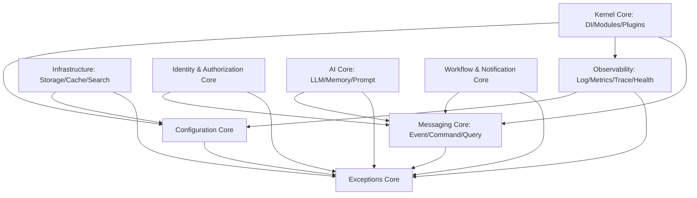

# Diagrama de Dependencias del Core

El `NovaNews OS Core` está diseñado bajo un modelo de **Zero-Coupling Interno**. Todos los submódulos dependen exclusivamente de abstracciones (interfaces) y los tipos primarios (Exceptions y Config).

## Dependencias Direccionales

## Orden de Implementación
1. **Exceptions Base** (Errores de dominio y sistema).
2. **Configuration Core** (Interfaces de configuración).
3. **Observability Core** (Logging, Health, Metrics).
4. **Messaging Core** (Bus de eventos, comandos y consultas).
5. **Infrastructure Core** (Interfaces de Caché, Storage, Search).
6. **Identity Core** (Usuarios, Roles, Permisos).
7. **AI Core** (Providers, Prompts, Memory).
8. **Workflow & Analytics** (Flujos y Métricas).
9. **Kernel Core** (DI, Loaders).
